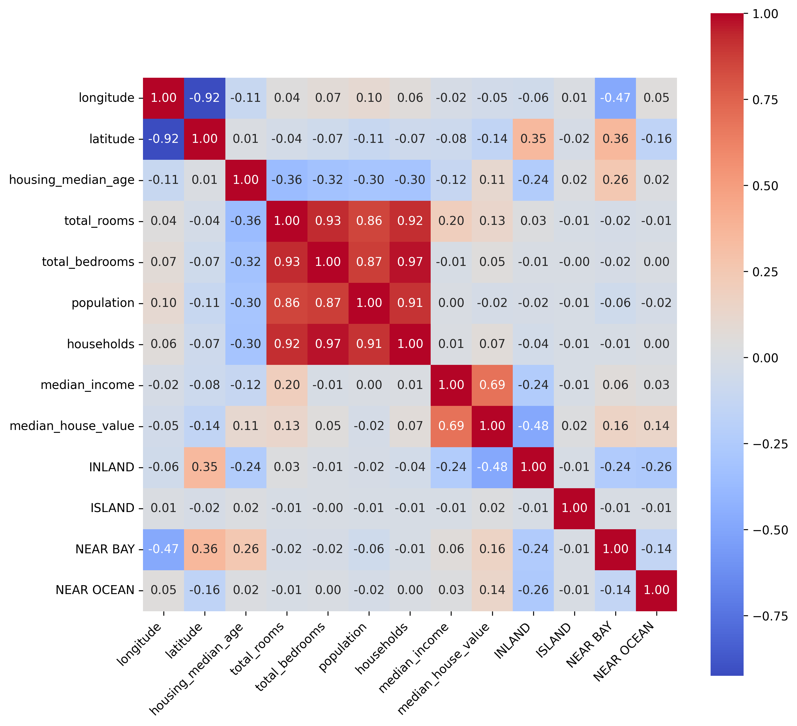
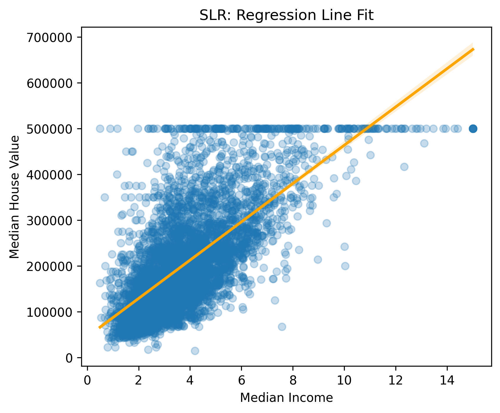
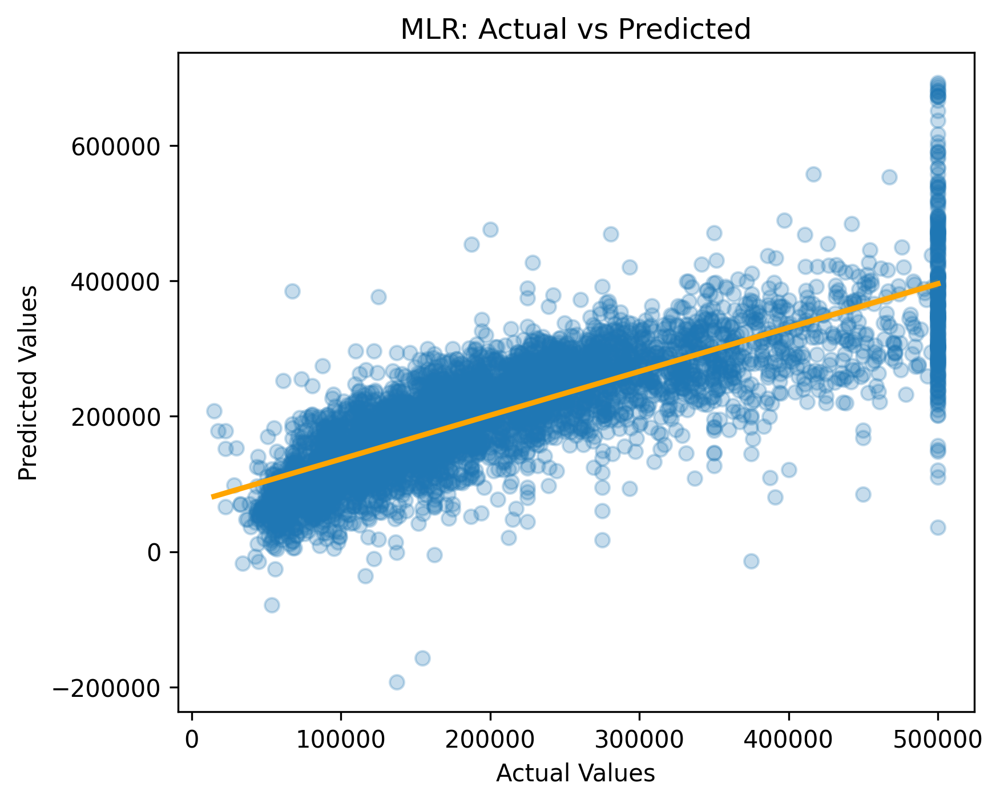

# 🏠 SLR vs MLR Comparison – California Housing Price Prediction

This project implements and compares **Simple Linear Regression (SLR)** and **Multiple Linear Regression (MLR)** using the California Housing dataset.  
It evaluates how increasing feature complexity affects model performance in predicting housing prices.

---

---

## 📌 Objective

- Build a baseline regression model using a single feature (`median_income`)
- Build a full-feature regression model using all available features
- Compare SLR and MLR performance using regression metrics
- Visualize prediction quality and model fit
- Understand the impact of feature richness in linear regression

---

## 📊 Dataset

- Dataset: California Housing Dataset
- Target variable: `median_house_value`

### Features:
- `median_income`
- `housing_median_age`
- `total_rooms`
- `total_bedrooms`
- `population`
- `households`
- `latitude`
- `longitude`
- `ocean_proximity` (categorical, one-hot encoded)

---

## ⚙️ Data Preprocessing

- Missing values handled using **median imputation**
- Categorical feature (`ocean_proximity`) encoded using **one-hot encoding**
- Features concatenated into final dataset
- Converted all data into numeric format for modeling

---

## 📈 Exploratory Data Analysis (EDA)

- Dataset overview using `info()` and `describe()`
- Missing value analysis
- Correlation matrix computation
- Heatmap visualization

📌 Correlation Heatmap:

---

## 🤖 Models

### 🔹 Simple Linear Regression (SLR)

- Input: `median_income`
- Target: `median_house_value`
- Purpose: baseline model using strongest single predictor

📌 Regression Fit:

---

### 🔹 Multiple Linear Regression (MLR)

- Input: all features except target
- Target: `median_house_value`
- Purpose: capture multi-variable relationships

📌 Actual vs Predicted:

---

## 📏 Evaluation Metrics

Both models were evaluated using:

- **R² Score**
- **Mean Squared Error (MSE)**
- **Root Mean Squared Error (RMSE)**

---

## 📊 Model Comparison

📌 R² Score Comparison:

.png)

---

## 🧠 Key Insights

- `median_income` is the strongest single predictor of house prices
- MLR improves performance by using multiple correlated features
- Feature engineering and preprocessing significantly affect model quality
- Linear regression performs well for structured tabular datasets

---

## 🛠️ Tech Stack

- Python
- NumPy
- Pandas
- Matplotlib
- Seaborn
- Scikit-learn

